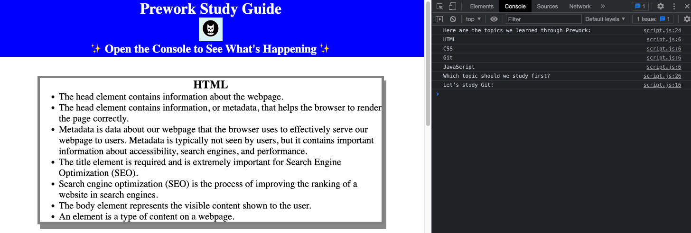

# Prework Study Guide Webpage

## Description

The Prework Study Guide was created as an introduction project for the UW Bootcamp to learn about HTML, CSS, GitHub & Git, and JS. 

## Installation

N/A

## Usage

* To view the guide, please navigate to the GitHub Pages URL
* To interact with the guide, open the Chrome DevTools by pressing Command+Option+I (macOS) or Control+Shift+I (Windows) and examine the Console as shown in the picture reference below:

## Credits

The following tutorials have contributed to the creation of this guide:
* [Intro to GitHub](https://handbook.tts.gsa.gov/training-and-development/intro-to-github/)
* [GitHub flow](https://docs.github.com/en/get-started/quickstart/github-flow)
* [JavaScript MDN Web Docs](https://developer.mozilla.org/en-US/docs/Web/JavaScript)
* [JS basics](https://developer.mozilla.org/en-US/docs/Learn/Getting_started_with_the_web/JavaScript_basics)
* [JS data types and data structures](https://developer.mozilla.org/en-US/docs/Web/JavaScript/Data_structures)

## License

[LICENSE](LICENSE)
